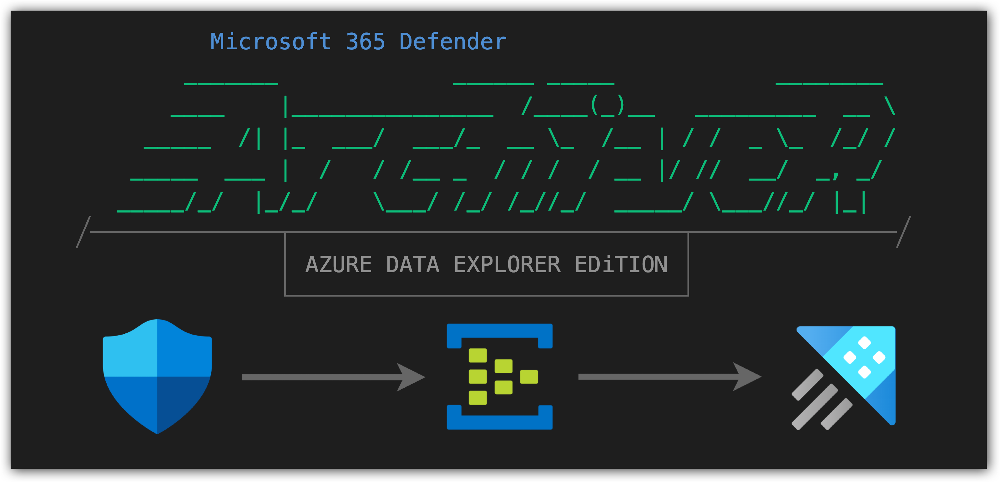
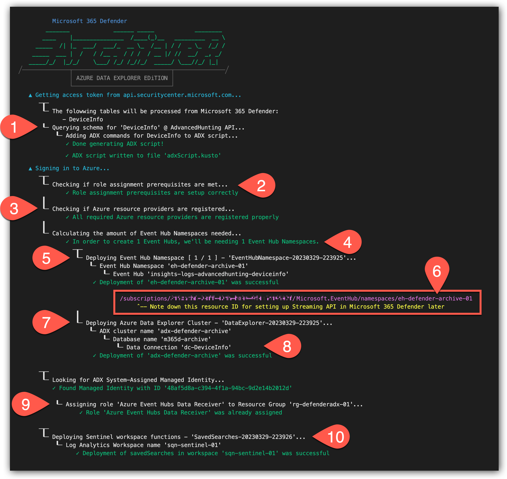
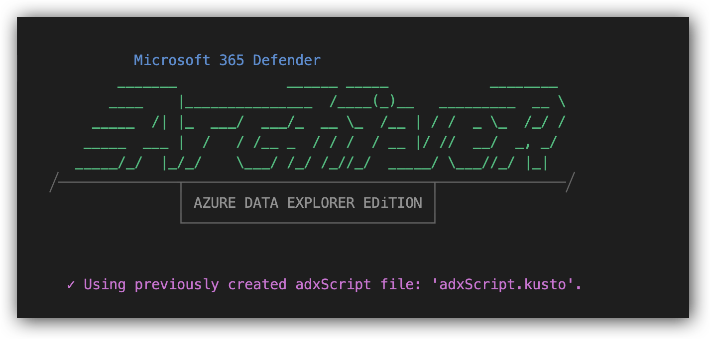
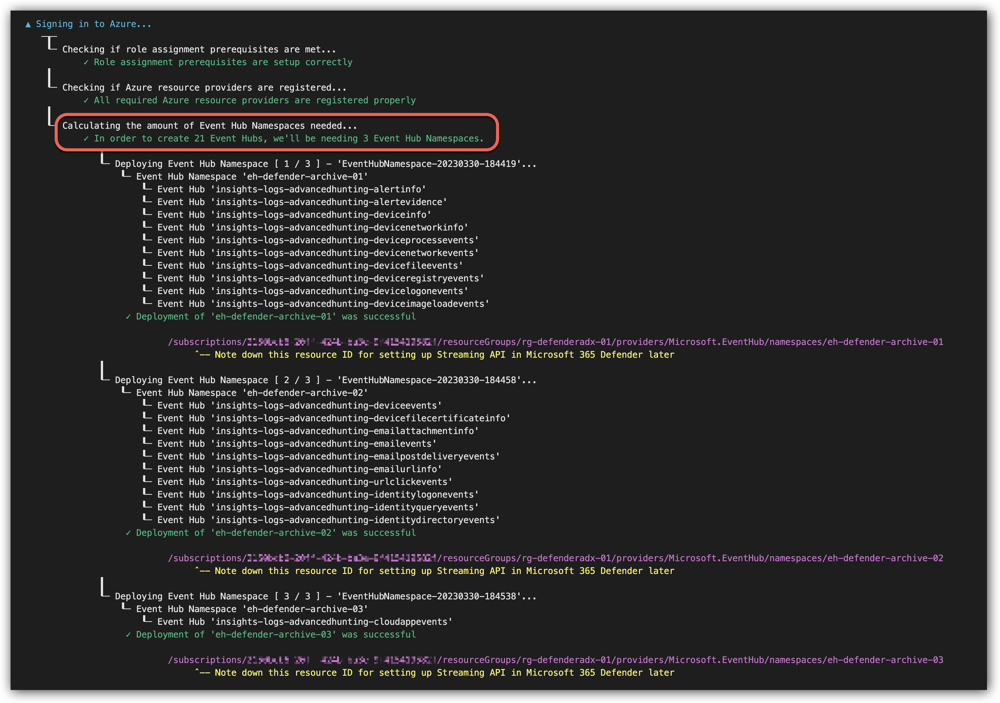
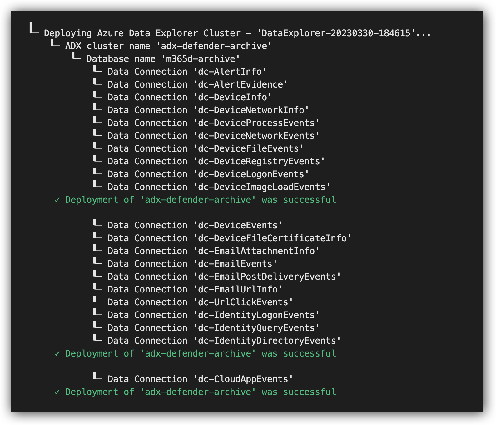
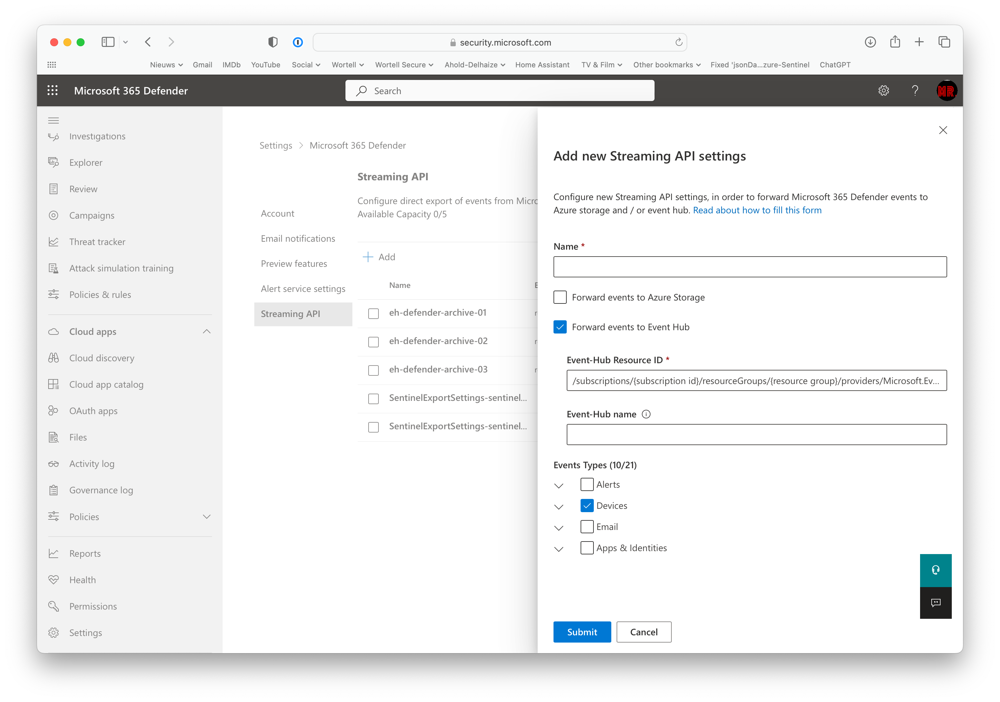

# Unlimited Advanced Hunting for Microsoft 365 Defender with Azure Data Explorer



> From [my article on Medium](https://medium.com/@koosg/unlimited-advanced-hunting-for-microsoft-365-defender-with-azure-data-explorer-646b08307b75)
## Introduction

More and more customers ask me what the options are to extend the retention in Microsoft 365 Defender beyond the default 30 days.
Data like incidents, alerts and event timelines of devices remain available for 180 days. 

But in this particular case they’re referring to the Advanced Hunting data being purged beyond 30 days. So you won't be able to use Kusto Query Language (KQL) to look for events in the "raw data". And for pro-active hunting purposes, I can agree with my customers; this is just too short.

In this article I'd like to demonstrate how you can leverage Azure Data Explorer (ADX) to archive data from Microsoft 356 Defender without having to make use of Microsoft Sentinel in between. Because relaying this data through Sentinel is not preferred by most, due to the added costs that come along with it. Which can be huge in some cases.

> I'll also be providing a PowerShell script and ARM templates which will make the entire deployment very easy.

## File overview


* `DefenderArchiveR.ps1` | PowerShell script for automated deployment
* `dataexplorer.template.json` | ARM template for deploying ADX
* `eventhub.template.json` | ARM template for deploying Event Hub(s)
* `workspacefunction.template.json` | template for deploying (Sentinel) workspace functions

## DefenderArchiveR.ps1

### Prerequisites

Before we can run the script we need to meet a couple of prerequisites:

* Make sure all hard-coded variables inside the script meet your environmental needs.
* Create an App Registration which is used to query the Microsoft Graph API to collect the schema of each of the tables in Defender. This Application needs ThreatHunting.ReadAll permissions for Microsoft.Graph. Make sure to grant admin consent and assign a secret with a very short lifespan, we'll only need to do this once. (more on this below)
* The Azure Subscription requires two resource provides to be registered: Microsoft.EventHub and Microsoft.Kusto. The script will check the status of these, but will not enable them for you.
* The user running DefenderArchiveR.ps1 need to have either Owner or Contributor and UserAccess Administrator role(s) on the Azure subscription. This is needed to deploy the Azure resources, but also to make sure the ADX system-assigned Managed Identity has the required permissions on the Event Hub(s).

### Parameters

DefenderArchiveR’s behavior can be modified with some parameters:

| Parameter | Description |
| --- | --- |
| `tenantId` | The Tenant ID of the Azure Active Directory in which the app registration and Azure subscription resides. |
| `appId` | The App ID of the application used to query Microsoft Graph to retrieve Defender table schemas. |
| `appSecret` | An active secret for the App Registration to query Microsoft Graph to retrieve Defender table schemas. |
| `subscriptionId` | Azure Subscription ID in which the archive resources should be deployed. |
| `resourceGroupName` | Name of the Resource Group in which archive resources should be deployed. |
| `m365defenderTables` | Comma-separated list of tables you want to setup an archive for. Keep in mind to use proper "PascalCase" for table names! If this parameter is not provided, the script will use all tables supported by Streaming API, and will setup archival on all of them. |
| `outputAdxScript` | Used for debugging purposes so that the script will output the ADX script on screen before it gets passed into the deployments. |
| `saveAdxScript` | Use -savedAdxScript switch to write content of $adxScript to ‘adxScript.kusto’ file. File can be re-used with -useAdxScript parameter. |
| `userAdxScript` | Provide path to existing ‘adxScript.kusto’ file created by -saveAdxScript parameter. |
| `skipPreReqChecks` | Skip Azure subscription checks like checking enabled resource providers and current permissions. Useful when using this script in a pipeline where you’re already sure of these prerequisites. |
| `noDeploy` | Used for debugging purposes so that the actual Azure deployment steps are skipped. |
| `deploySentinelFunctions` | Use -deploySentinelFunctions switch to add optional step to the deployment process where (Sentinel) workspace functions are deployed (savedSearches) to be able to query ADX from Log Analytics / Sentinel UI. (more on this below) |

### Examples

#### Example with a single table

Let's say we only want to archive the DeviceInfo table from Defender. We can run DefenderArchiveR as follows:

```PowerShell
./DefenderArchiveR.ps1 `
    -tenantId '<tenantId>' `
    -appId '<application(client)Id>' `
    -appSecret '<applicationSecret>' `
    -subscriptionId '<subscriptionId>' `
    -resourceGroupName '<resourceGroupName>' `
    -m365defenderTables 'DeviceInfo' `
    -deploySentinelFunctions `
    -saveAdxScript
```



1. Since only theDeviceInfo table was provided, that's the only schema it will retrieve via the Microsoft Graph API. During this step a variable named $adxScript will be populated with all the ADX commands required for setting up the tables, mapping, expand function and policy. This will be used in a later step when setting up ADX. And because we used the -saveAdxScript parameter, this variable is now also stored into a file named adxScript.kusto for reuse in incremental redeployments. (see next example)
2. A browser pop-up will ask the user to sign-in. If the user was already signed-in by running Connect-AzAccount this will be skipped. After signing-in to Azure, it will check if the current user has the appropriate permissions….
3. …and if the subscription has the required resource providers registered.
4. The script will "calculate" how many Event Hub Namespaces will be required for deployment. Remember that we can only have ten Event Hubs per Event Hub Namespace. In this case only one is required.
5. The Event Hub Namespace will be deployed including a single Event Hub for DeviceInfo event messages to land in.
6. The Resource ID of the Event Hub Namespace will be displayed. We'll need this at the end when configuring Streaming API in Defender.
7. The Azure Data Explorer (ADX) cluster will be deployed including a single database. The $adxScript variable will be used as part of the deployment to make sure all the required ADX commands are executed.
8. And for every table provided, it will create a data connection for event message retrieval from the Event Hub.
9. The system-assigned Managed Identity of the ADX cluster will be assigned the "Azure Event Hubs Data Receiver" role on the resource group. This is required for the data connections retrieving the Event Hub messages to work.
10. This step is optional and will deploy KQL functions inside a (Sentinel) workspace so that you're able to query the ADX data from within the workspace UI. Instead of needing to go to the ADX query interface.

#### Example with selection of all tables

Now let's look at an example where we want to archive all tables. For the sake of this example; let's say this is the second time we run the script, and we have already saved the adxScript to a file in a previous run. (as demonstrated above)

```PowerShell
./DefenderArchiveR.ps1 `
    -tenantId '<tenantId>' `
    -appId '<application(client)Id>' `
    -appSecret '<applicationSecret>' `
    -subscriptionId '<subscriptionId>' `
    -resourceGroupName '<resourceGroupName>' `
    -useAdxScriptFile 'adxScript.kusto'
```



> An existing 'adxScript.kusto' file, containing all the ADX commands, is reused and thus skipping the schema retrieval of the tables.



> Note that there are now three Namespaces required to host twenty-one Event Hubs



> The deployment of ADX is also repeated three times to make sure all data connections are in place

## Configuring Defender Streaming API

Once DefenderArchiveR ran successful, the only thing left to do is to configure the Streaming API within Defender:

* Make sure you've activated the Global Administrator role
* Visit <https://security.microsoft.com> and go to Settings → Microsoft 365 Defender → Streaming API and click "Add"



* Provide a suitable name and the Resource ID of the Event Hub Namespace you deployed earlier.

> **Make sure to leave the "Event Hub name" field empty!**

* Select the tables you'll be sending to that specific Namespace. The first 10 tables go into the first Namespace etc. As a reference you can also peek at DefenderArchiverR’s output, to know which table goes where.
* Repeat this step up to three times, depending on the amount of tables you're forwarding and the amount of Namespaces you deployed to facilitate them.

## You're all set!

Please give it up to 30 minutes before logs will flow into your Event Hubs and into Azure Data Explorer.

Once your data is ingested, you can enjoy endless data retention and endless KQL queries because your results are no longer limited to the same query limits that apply to Sentinel / Defender.

You'll probably notice that the results do come back a bit slower than you might be used to. This has to to do with the ADX cluster tier, how much instances there are available and the compute size of these instances. It's also possible to cache a certain amount of data for better performance. But the slower performance might not be a huge problem. When using the data periodically (for pro-active threat hunting, forensic investigations and/or to simply meet compliance requirements) it might be sufficient.

All of these choices, and more like data compression and cost benefits, will be detailed in Part II of this article and will be coming soon!

So follow me on Medium or keep an eye on my Twitter and LinkedIn feeds to get notified once this is released.

I still wouldn’t call myself an expert on PowerShell. So if you have feedback on any of my approaches above, please let me know! Also never hesitate to fork my repository and submit a pull request. They always make me smile because I learn from them and it will help out others using these tools. 👌🏻

I hope you like this tool and it will make your environment safer as well!

If you have any follow-up questions, please reach out to me!

— Koos
